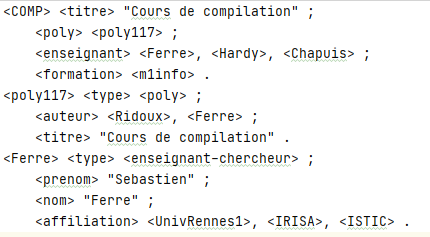
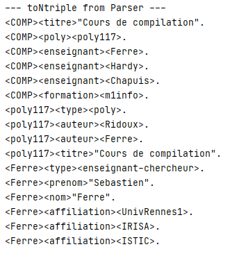

# Turtle Parser

Parse Turtle file with antlr.  
Convert parsed result in NTriple.

Exercise for University.

## Preview

**Turtle input file**  


**NTriple Console output**    


## How to start

Get dependencies.
```shell
gradlew
```

Define program arguments in IDE

```sh
./tests/test1.ttl
OR
./tests/test2.ttl
```

Then Run 'Main'. ▶
